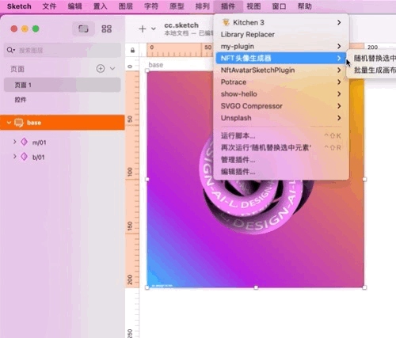
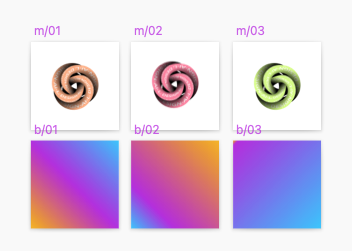
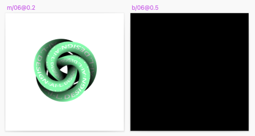

# NFT头像生成SKetch插件 ｜ NFT Avatar generate sketch plugin 

## 插件使用
下载：
* [nft-avatar.sketchplugin](./example/nft-avatar.sketchplugin.zip) 
* [示例sketch文件](./example/cc.sketch)



将画板(Artboard)上面所有控件(Symbol)按照路径命名（用`/`分割）的方式进行分组，如`m/01`，程序会根据分组进行替换控件。如下图：



在画板中组合好控件，就可以使用了。

### 高级用法
如果是稀缺控件可以在名字后面跟上`@概率`，如`m/0@0.5`，可以让该控件相对于同组叠加0.5的稀有度。




## 插件开发


## Installation

- [Download](../../releases/latest/download/nft-avatar.sketchplugin.zip) the latest release of the plugin
- Un-zip
- Double-click on nft-avatar.sketchplugin

## Development Guide

_This plugin was created using `skpm`. For a detailed explanation on how things work, checkout the [skpm Readme](https://github.com/skpm/skpm/blob/master/README.md)._

### Usage

Install the dependencies

```bash
npm install
```

Once the installation is done, you can run some commands inside the project folder:

```bash
npm run build
```

To watch for changes:

```bash
npm run watch
```

Additionally, if you wish to run the plugin every time it is built:

```bash
npm run start
```

### Custom Configuration

#### Babel

To customize Babel, you have two options:

- You may create a [`.babelrc`](https://babeljs.io/docs/usage/babelrc) file in your project's root directory. Any settings you define here will overwrite matching config-keys within skpm preset. For example, if you pass a "presets" object, it will replace & reset all Babel presets that skpm defaults to.

- If you'd like to modify or add to the existing Babel config, you must use a `webpack.skpm.config.js` file. Visit the [Webpack](#webpack) section for more info.

#### Webpack

To customize webpack create `webpack.skpm.config.js` file which exports function that will change webpack's config.

```js
/**
 * Function that mutates original webpack config.
 * Supports asynchronous changes when promise is returned.
 *
 * @param {object} config - original webpack config.
 * @param {boolean} isPluginCommand - whether the config is for a plugin command or a resource
 **/
module.exports = function(config, isPluginCommand) {
  /** you can change config here **/
}
```

### Debugging

To view the output of your `console.log`, you have a few different options:

- Use the [`sketch-dev-tools`](https://github.com/skpm/sketch-dev-tools)
- Run `skpm log` in your Terminal, with the optional `-f` argument (`skpm log -f`) which causes `skpm log` to not stop when the end of logs is reached, but rather to wait for additional data to be appended to the input

### Publishing your plugin

```bash
skpm publish <bump>
```

(where `bump` can be `patch`, `minor` or `major`)

`skpm publish` will create a new release on your GitHub repository and create an appcast file in order for Sketch users to be notified of the update.

You will need to specify a `repository` in the `package.json`:

```diff
...
+ "repository" : {
+   "type": "git",
+   "url": "git+https://github.com/ORG/NAME.git"
+  }
...
```
